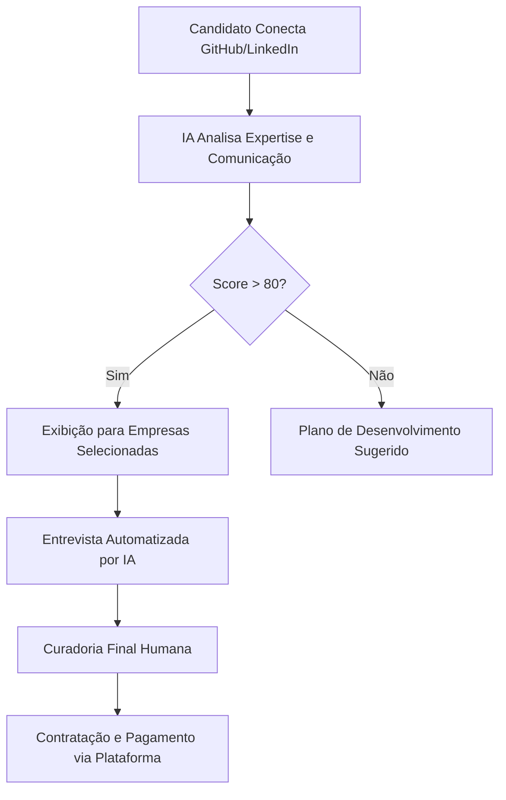

# Contexto de Negócio e Nuances Internacionais

Este documento detalha os fundamentos da plataforma, focando na entrega de valor e na mitigação de riscos em contratações internacionais.

## 1. O Problema: "The Friction Gap"

Contratar desenvolvedores em outros países gera três atritos principais:
- **Técnico:** Como saber se o candidato realmente domina a stack se os projetos no GitHub são antigos?
- **Comunicação:** O candidato consegue se expressar bem em uma reunião de Sprint em inglês?
- **Jurídico/Financeiro:** Como pagar alguém no Brasil de forma legal, rápida e com baixo custo?

## 2. A Solução: Curadoria Inteligente

A nossa plataforma não é apenas um job board, é um **Filtro de Confiança**.

### Nuances de Entrega de Valor

#### A. Para a Empresa (Recrutador)
- **Candidatos Pré-Auditados:** A IA já analisou o GitHub, o currículo e o LinkedIn antes do primeiro contato humano.
- **Speech Proficiency Score:** Não basta "falar inglês", a IA avalia a capacidade de explicar conceitos técnicos (System Design) de forma clara.
- **Automated Interaction:** O recrutador cadastra perguntas específicas, e a IA faz a primeira entrevista assíncrona, economizando dezenas de horas.

#### B. Para o Candidato
- **Visibilidade Global:** Exposição a empresas Tier 1 sem precisar "caçar" vagas.
- **Análise de Gap:** Se o candidato não passou, a IA fornece um relatório detalhado do porquê (ex: "Sua fluência em inglês está nível B1, recomendamos focar em verbos irregulares para chegar ao B2").
- **Assinatura e Gestão:** Ambiente para gerenciar contratos, faturas (invoices) e pagamentos internacionais simplificados.

## 3. Segurança e Governança

- **Anti-Fraude:** Verificação de identidade (KYC) para evitar "ghost hiring".
- **Garantia de Entrega:** Sistema de escrow ou retenção para garantir que o candidato receba e a empresa tenha a entrega.
- **Proteção de IP:** Contratos padronizados que garantem que o código escrito pertence à empresa internacional.

## 4. O Círculo de Valor (Value Loop)

