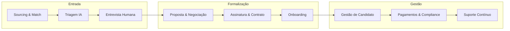

# Especificação Completa: Sistema de Recrutamento, Seleção, Assinatura e Gestão de Candidatos Dev (Mercado Exterior)

Este documento consolida o fluxo end-to-end da plataforma, com ênfase em **segurança jurídica e operacional** e **entrega de valor equilibrada** para empresas contratantes e candidatos.

---

## 1. Visão do Fluxo End-to-End

| Fase | Responsável principal | Documento de referência |
|------|------------------------|--------------------------|
| Recrutamento & Sourcing | Plataforma + Recrutador | [recruitment-selection.md](modules/recruitment-selection.md) |
| Seleção (triagem + entrevista) | IA + Recrutador | [ai-interviewer.md](modules/ai-interviewer.md) |
| Assinatura & Pagamentos | Plataforma (FinOps) | [contracts-payments.md](modules/contracts-payments.md), [latam-compliance.md](technical/latam-compliance.md) |
| Gestão de candidatos | Candidato + Empresa + Plataforma | [candidate-portal.md](modules/candidate-portal.md) |

---

## 2. Recrutamento e Seleção — Nuances de Segurança e Valor

### 2.1 Para a Empresa Contratante

**Valor entregue:**
- **Filtro técnico confiável:** Match baseado em análise real de GitHub + currículo + LinkedIn, não só palavras-chave.
- **Redução de ruído:** Apenas candidatos acima do threshold (ex.: Top N ou score mínimo) chegam à etapa humana.
- **Speech & fluência:** Avaliação objetiva de inglês técnico e clareza antes da entrevista ao vivo.
- **Feedback estruturado:** Relatórios da IA (system design, resiliência, vocabulário) para decisão consistente.

**Segurança e proteção:**
- **Antifraude de identidade:** KYC (documento + biometria) e cruzamento GitHub/LinkedIn para garantir que a pessoa entrevistada é a contratada.
- **Monitoramento em entrevista:** IA pode sinalizar inconsistências (troca de pessoa, uso de auxílio externo) durante sessões por vídeo/voz.
- **Proteção de IP:** Contratos padrão que atribuem todo código e IP gerado durante o vínculo à empresa; orientação para uso de VDI/ambientes corporativos quando aplicável.
- **Garantia de entrega:** Success Fee em escrow + bônus de retenção (ex.: 90 dias) liberados conforme milestones, alinhando incentivos da plataforma à permanência do candidato.

**Referência:** [recruitment-selection.md](modules/recruitment-selection.md), [ai-interviewer.md](modules/ai-interviewer.md), [security-compliance.md](security-compliance.md).

### 2.2 Para o Candidato

**Valor entregue:**
- **Transparência do processo:** Critérios de match e pesos (ex.: stack, cultura, comunicação) visíveis ou explicados.
- **Feedback sempre:** Política "Zero Ghosting" — todo candidato recebe feedback gerado pela IA, mesmo quando não segue no processo.
- **Preparação:** Mock interviews e gap analysis (ex.: "90% match para DevOps UK; falta Terraform") para evoluir antes da próxima oportunidade.
- **Curadoria:** Exposição a vagas alinhadas ao perfil, reduzindo tempo em processos inadequados.

**Segurança e proteção:**
- **Consentimento e dados:** Coleta e uso de dados (currículo, GitHub, LinkedIn, áudio/vídeo) com consentimento explícito; direitos de acesso, correção e exclusão (LGPD/GDPR).
- **Uso de áudio/vídeo:** Processamento conforme política de privacidade; deleção ou anonimização após análise, quando aplicável.
- **Não discriminação:** Critérios técnicos e de comunicação documentados; sem uso de dados sensíveis (origem, etnia, religião) em ranking.
- **Proteção contra ghosting da empresa:** Prazos e expectativas claros por etapa (ex.: prazo para retorno após entrevista); onde aplicável, SLA da plataforma com o contratante.

**Referência:** [ai-interviewer.md](modules/ai-interviewer.md), [security-compliance.md](security-compliance.md).

---

## 3. Assinatura, Contratos e Pagamentos — Nuances de Segurança e Valor

### 3.1 Modelos de Engajamento

- **PJ (Independent Contractor):** Contrato direto empresa ↔ candidato; plataforma facilita invoice, repasse e, quando aplicável, emissão de NF-e local.
- **EOR (Employer of Record):** Plataforma como empregador legal no país do candidato; empresa paga à plataforma; encargos trabalhistas e compliance local centralizados.

**Referência:** [contracts-payments.md](modules/contracts-payments.md).

### 3.2 Para a Empresa Contratante

**Valor entregue:**
- **Um único ponto de contato:** Contrato e pagamento em moeda forte (USD/EUR/GBP); plataforma resolve repasse local e documentação fiscal.
- **Previsibilidade:** Planos Growth (mensal + success fee), Enterprise (anual, contratações ilimitadas) ou On-Demand (por vaga).
- **Compliance fiscal internacional:** Invoices geradas automaticamente; suporte a W-8BEN e demais formulários fiscais exigidos.
- **Certificado de compliance:** Comprovação de que impostos e obrigações locais do candidato estão em dia (redução de risco de co-employment).

**Segurança e proteção:**
- **Escrow:** Success Fee e bônus de retenção retidos até cumprimento de condições (ex.: dia 1 para success fee; bônus após 3º mês ativo).
- **Contratos padronizados:** Cláusulas de IP, confidencialidade e lei aplicável revisáveis pela empresa; versões auditáveis.
- **Multimoeda e conciliação:** Pagamento em moeda forte; plataforma gerencia câmbio e documentação (PTAX/spot) para conciliação contábil.

**Referência:** [contracts-payments.md](modules/contracts-payments.md), [technical/latam-compliance.md](technical/latam-compliance.md).

### 3.3 Para o Candidato

**Valor entregue:**
- **Recebimento garantido:** Pagamento via gateway (Stripe, Deel, Payoneer, etc.); fundos em escrow até liberação conforme regras.
- **Conversão e NF-e:** Valores convertidos com critério transparente (ex.: PTAX + spread definido); integração com emissão de NF-e (CNAE de exportação de serviços, sugestão de regime tributário).
- **Visibilidade financeira:** Histórico de invoices e pagamentos no portal; projeção de valor líquido por proposta (impostos e taxas considerados).
- **Suporte fiscal:** Relatórios para IR (ex.: Informe de Rendimentos); integração com contabilidades parceiras e, quando aplicável, geração de DARF e pagamento de tributos a partir da retenção.

**Segurança e proteção:**
- **Clareza de valores:** Proposta com valor bruto, taxas da plataforma, impostos estimados e valor líquido antes da aceitação.
- **Proteção em caso de atraso/não pagamento:** Regras claras de liberação de escrow e suporte da plataforma em disputas; documentação de todos os pagamentos para comprovação.
- **Procurador limitado (opcional):** Possibilidade de outorgar procuração limitada a contabilidade parceira para assinar e entregar obrigações fiscais em nome do candidato.
- **Compliance local:** Retenção de tributos e contribuições conforme a lei do país (Brasil, México, Argentina, Colômbia, etc.); certificado de regularidade para o cliente.

**Referência:** [contracts-payments.md](modules/contracts-payments.md), [technical/latam-compliance.md](technical/latam-compliance.md), [candidate-portal.md](modules/candidate-portal.md).

---

## 4. Gestão de Candidatos (Pós-Contratação) — Nuances de Segurança e Valor

### 4.1 Para a Empresa Contratante

**Valor entregue:**
- **Visibilidade do vínculo:** Status do contrato, pagamentos em dia e compliance do candidato (certificado de compliance).
- **Menor risco co-employment:** EOR ou fluxos PJ com documentação e retenção fiscal adequadas.
- **Continuidade:** Candidato com suporte contábil e fiscal pela plataforma tende a menor atrito por questões burocráticas.

**Segurança e proteção:**
- **IP e confidencialidade:** Contratos e orientações reforçadas (VDI, máquinas da empresa, políticas de código).
- **Rastreabilidade:** Auditoria de acessos e logs onde aplicável; relatórios de atividade conforme contrato.

### 4.2 Para o Candidato

**Valor entregue:**
- **Portal unificado:** Perfil 360°, badges de proficiência (IA), histórico de invoices, status de propostas e contratos.
- **Career coach (IA):** Gap analysis, sugestões de vagas, mock interviews e planejamento de carreira.
- **Gestão de disponibilidade:** Status "Open to Work", "Passive", "Unavailable"; central de propostas com comparação de valor líquido.
- **Vida financeira e previdenciária:** Integração com contabilidade digital, painel de impostos, pró-labore sugerido, seguro saúde global, previdência e fórum PJ internacional.

**Segurança e proteção:**
- **Autopay fiscal (opcional):** Separação automática de percentual para impostos em subconta.
- **Propriedade dos dados:** Dados do candidato portáveis e excluíveis conforme LGPD/GDPR; uso apenas para os fins consentidos.
- **Suporte em disputas:** Canal claro para questões de pagamento, contrato ou compliance; documentação centralizada no portal.

**Referência:** [candidate-portal.md](modules/candidate-portal.md), [security-compliance.md](security-compliance.md).

---

## 5. Segurança Transversal (Ambos os Lados)

| Dimensão | Empresa | Candidato |
|----------|---------|-----------|
| **Dados (GDPR/LGPD)** | Dados do processo minimizados; SCCs para transferência internacional. | Consentimento, acesso, correção, exclusão; minimização. |
| **Identidade e fraude** | KYC + verificação de identidade do candidato; monitoramento em entrevista. | Processo justo; critérios técnicos; sem discriminação. |
| **Cibernética** | MFA para recrutadores/admin; criptografia (AES-256, TLS 1.3); logs de acesso. | Mesma infraestrutura segura; senha + MFA onde aplicável. |
| **Incidentes** | Notificação em até 72h (GDPR); plano de resposta a incidentes. | Transparência em caso de vazamento ou falha. |
| **IP e confidencialidade** | Contratos de IP e NDA; orientação de ambientes seguros. | Clareza sobre titularidade do código e limites de uso. |

**Referência:** [security-compliance.md](security-compliance.md), [technical/iam-auth-system.md](technical/iam-auth-system.md).

---

## 6. Resumo: Compromissos Bilaterais

- **Plataforma → Empresa:** Candidatos curados (técnico + comunicação), compliance fiscal e contratual, escrow e garantias de entrega, proteção de IP e dados.
- **Plataforma → Candidato:** Recebimento garantido, transparência de critérios e valores, feedback sempre, suporte fiscal e de carreira, privacidade e portabilidade de dados.
- **Empresa ↔ Candidato:** Contrato claro (PJ ou EOR), prazos e expectativas definidos, canal de suporte para disputas via plataforma.

Este documento deve ser lido em conjunto com os módulos e documentos técnicos listados em cada seção para implementação e operação completas do sistema.
