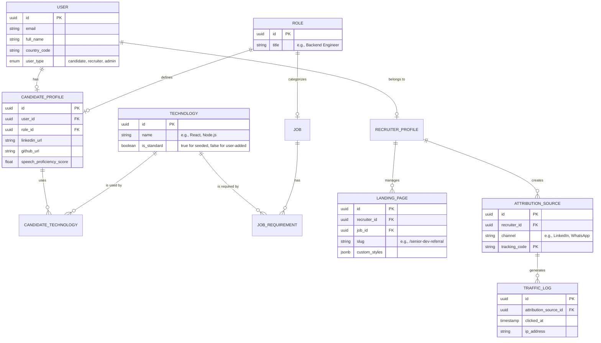

# Database Schema & Data Strategy

This document outlines the technical data model for the international recruitment platform. The schema is designed for scalability, localized performance, and flexible technology mapping.

## 1. Entity Relationship Diagram (ERD)

## 2. "Suggest vs Input" Logic

To maintain data cleanlines while allowing flexibility:
1.  **Selection:** When a user (candidate or recruiter) adds a technology, the UI first provides a list of `standard` technologies (where `is_standard = true`).
2.  **Creation:** If the technology is not found, the user can type a custom name.
3.  **Handling:** The system creates a new entry in the `TECHNOLOGY` table with `is_standard = false`. Admins can later review these custom entries and merge them into standard ones if they reach a certain threshold of usage.

## 3. Core Tables Reference

### `technologies`
Standardized list of tech stacks to enable the AI matching engine.

### `roles`
Categorization of job functions to align expectations between hiring managers and developers.

### `candidate_technologies`
Join table with `proficiency_level` (1-5) and `years_of_experience` to refine the Match Score.

### `landing_pages`
Stores custom templates and settings for recruiter-generated sourcing pages.

### `attribution_sources`
Mapping of unique tracking codes to specific recruiters and channels (LinkedIn, X, etc.).

### `traffic_logs`
High-volume table tracking clicks and candidate origins to power the Attribution Dashboard.

---

> [!NOTE]
> **Internationalization:** All core data (roles, technologies) is stored in English to facilitate matching with international job descriptions. The UI layer handles translation if necessary.
