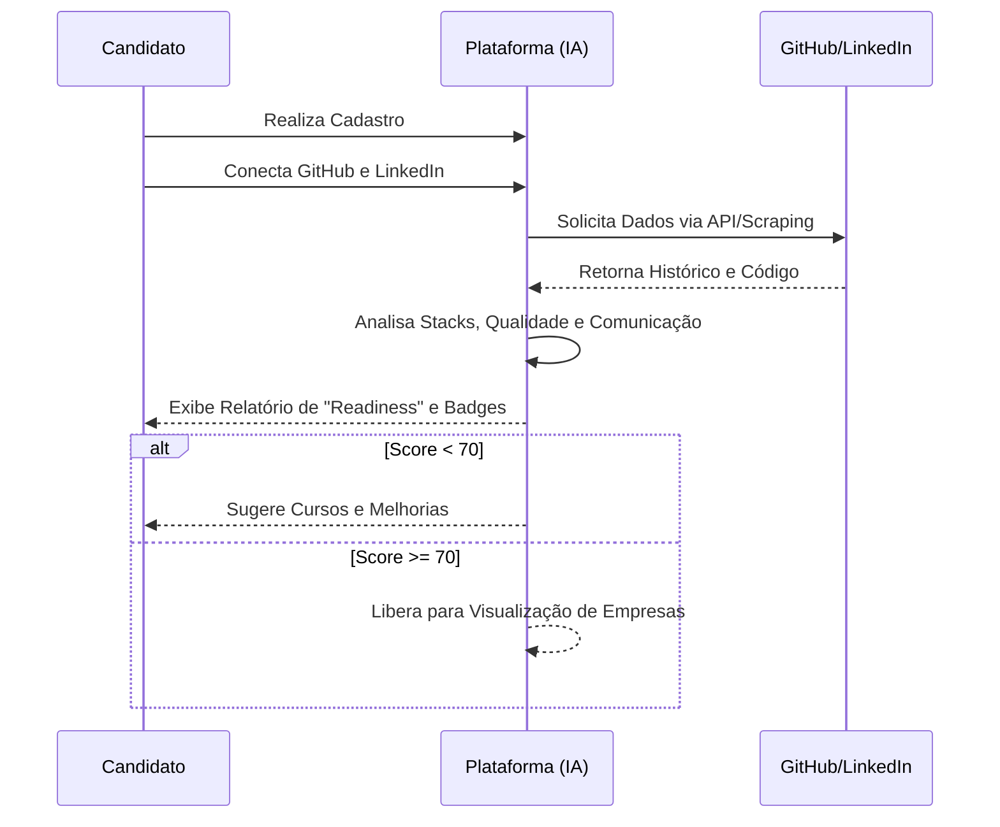
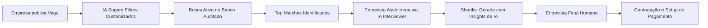
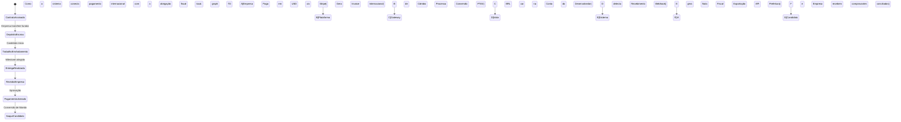
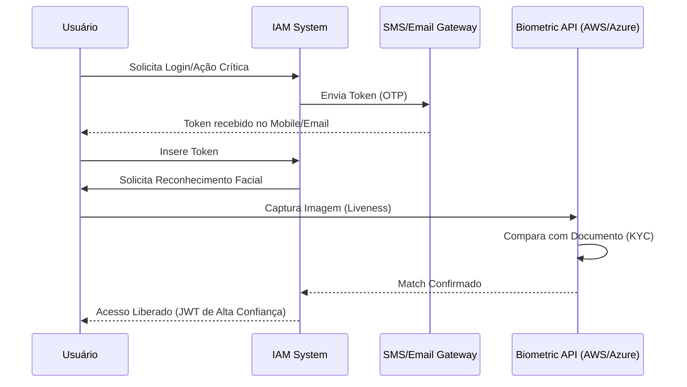
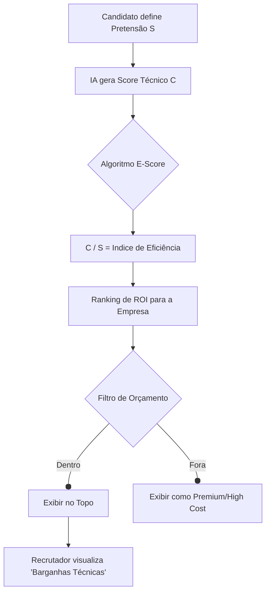
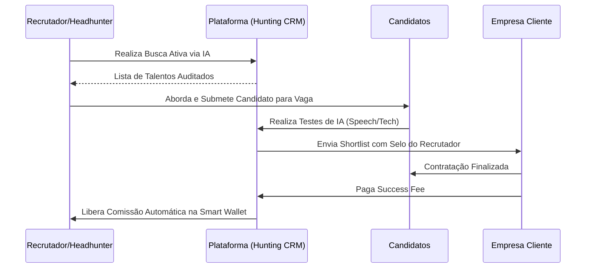
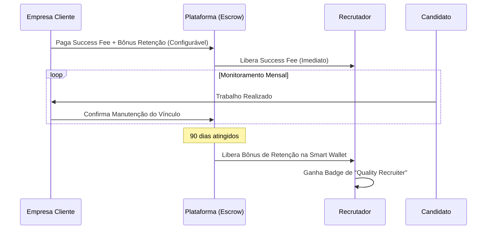
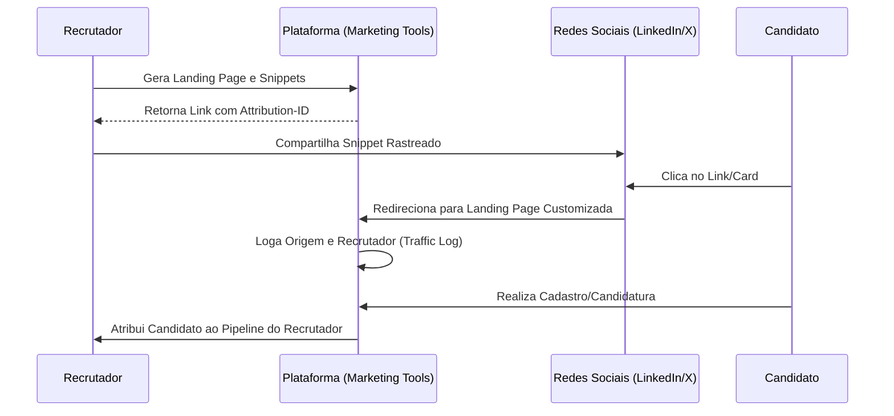

# Fluxos do Usuário (User Flows)

Este documento ilustra as jornadas principais dentro da plataforma utilizando diagramas Mermaid.

## 1. Onboarding e Auditoria do Candidato

Este fluxo mostra como a IA intervém desde o momento do cadastro para garantir a qualidade do pool de talentos.



## 2. Ciclo de Recrutamento Automatizado

Como a empresa interage com a plataforma para encontrar o candidato ideal.



## 3. Fluxo de Pagamento e Milestone

Nuance de segurança financeira para projetos ou contratos de longo prazo.



## 5. Ciclo de Amparo Contínuo (Pós-Contratação)

Acompanhamento do desenvolvedor para garantir retenção e saúde fiscal.

```mermaid
graph TD
    A[Início do Contrato] --> B[Abertura/Migração de Empresa PJ via Parceiro]
    B --> C[Recebimento Mensal via Plataforma]
    C --> D[Câmbio e Autofill de Nota Fiscal]
    D --> E[Cálculo de Imposto e Pró-Labore (IA)]
    E --> F[Dashboard de Saúde Financeira]
    F --> G{Novo Milestone ou Ano?}
    G -- Sim --> H[Revisão de Carreira e Mentoria IA]
    H --> C
```
## 6. Fluxo de Autenticação Segura (IAM & Biometria)

Como o sistema lida com tokens e verificação facial.



## 7. Fluxo de Retenção e Compliance Fiscal

Como o sistema gere a retenção de impostos e o repasse líquido.

```mermaid
graph TD
    A[Empresa Paga Valor Bruto] --> B{Smart Wallet (Retenção)}
    B -- Taxa Plataforma --> C[Receita Plataforma]
    B -- Provisão de Impostos --> D[Cálculo de Guia IR/DARF]
    D --> E[Pagamento Automático do Imposto via API]
    B -- Valor Líquido --> F[Conversão Câmbio]
    F --> G[Depósito Conta Candidato]
    G --> H[IA gera Declaração Anual de Renda]
```

## 8. Fluxo de Mobilidade Global e Visto

Jornada do desenvolvedor que deseja relocar para o exterior.

```mermaid
graph LR
    A[Candidato Remoto (High Performance)] --> B[Empresa solicita Relocação]
    B --> C[IA analisa Elegibilidade de Visto]
    C --> D[Geração Automática de Documentos e Contrato]
    D --> E[Submissão ao Consulado/Imigração]
    E --> F[Aprovação e Onboarding Presencial]
    F --> G[Gestão de Equity (Vesting) Inicia]
```

## 9. Fluxo de Leilão de Competência (Ranking de Eficiência)

Como a IA equilibra o custo-benefício para o recrutador.



## 10. Fluxo do Recrutador Pro (Hunting & Comissões)

Como recrutadores externos utilizam a plataforma para caçar talentos.



## 11. Fluxo de Recompensa por Retenção (3 Meses)

Como o sistema incentiva a contratação de longo prazo.



## 12. Fluxo de Marketing e Atribuição do Recrutador

Como o sistema rastreia a origem dos candidatos trazidos por recrutadores.


